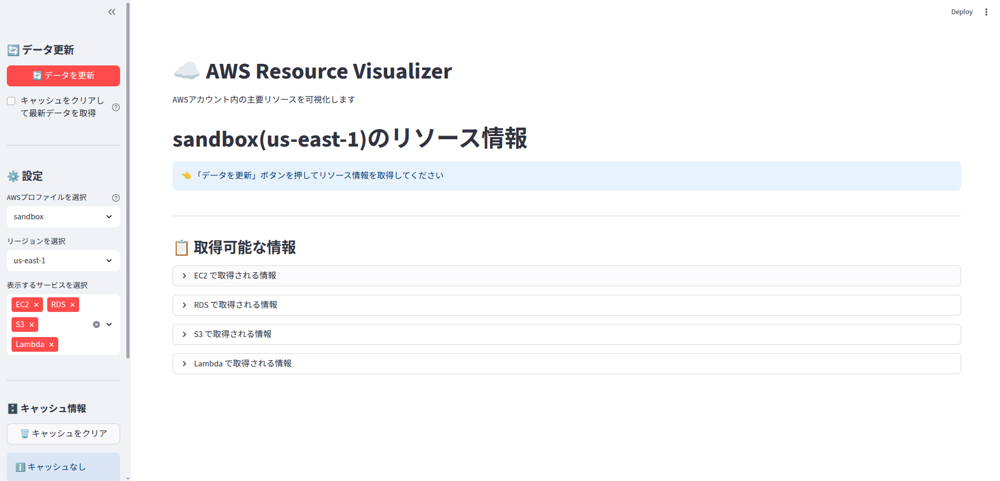
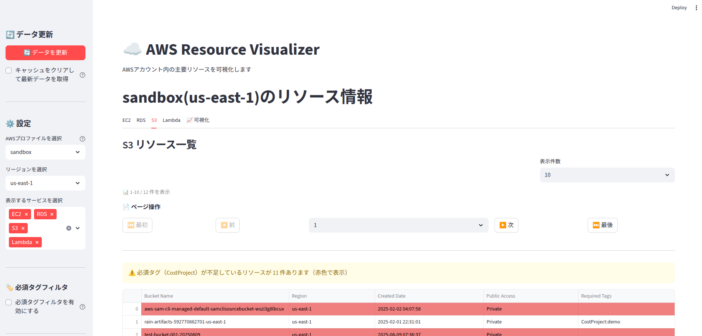
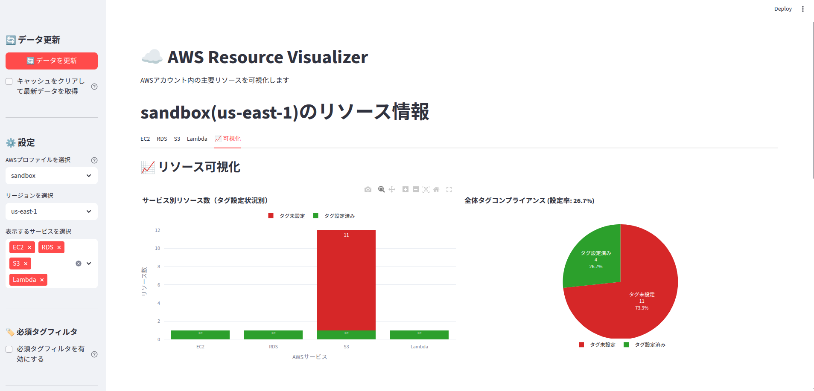
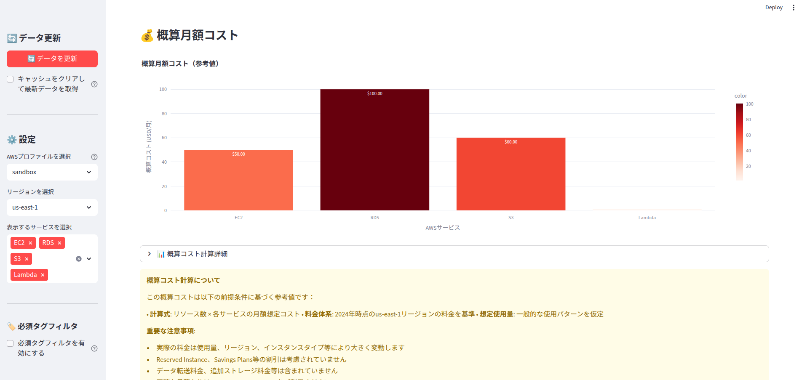

# AWS Resource Visualizer

[](https://www.python.org/)
[](https://python-poetry.org/)
[](https://github.com/casey/just)
[](https://streamlit.io/)
[](https://www.docker.com/)
[](https://boto3.amazonaws.com/v1/documentation/api/latest/index.html)

AWSアカウント内の主要リソース（EC2、RDS、S3、Lambda）を一覧表示・可視化するStreamlitアプリケーションです。  
コード及びドキュメント（図含む）は、`Amazon Q Developer CLI`で作成しています。

## このリポジトリについて

このリポジトリは参考用として公開しています。  
Pull Request や Issue への対応は行いません。

## 必要なソフトウェア

- Python 3.13.1+
- Poetry 2.1.2+
- just（タスクランナー）
- Docker
- AWS CLI v2

## 主要ファイル

- `docs/` - ドキュメント
- `cfn/` - CloudFormationテンプレート
- `rainlib/` - CloudFormation設定ファイル
- `justfile` - タスクランナー設定
- `justlib/` - justタスクライブラリ
- `app/` - アプリケーションファイル
- `app_web.py` - Streamlit実行用ラッパー
- `app_batch.py` - バッチ実行用ラッパー

## 構築手順

### 1. 依存関係のインストール

pythonの依存モジュールをインストール。

```bash
just pyinstall
```

poetryのpluginsをインストール。

``` bash
poetry self add poetry-plugin-export@latest
```

### 2. AWS認証設定

```bash
aws configure --profile sandbox
```

### 3. アプリケーション起動

#### Poetry環境での実行

```bash
just run
```

ブラウザで `http://localhost:8501` にアクセス。

#### Dockerでの実行

```bash
just docker-build
just docker-run
```

ブラウザで `http://localhost:8501` にアクセス。

#### AWS Fargateでの実行

- 構築手順は[開発ドキュメント](docs/development.md)を参照。
- ブラウザで `http://<FargateのIPアドレス>:8501` にアクセス。

**セキュリティ制限**: ECS Fargateでは、プレフィックスリストで定義されたIPアドレスからのみアクセス可能です。アクセスできない場合は、プレフィックスリストの設定を確認してください。

## スクリーンショット

### メイン画面


AWSリソースの概要とサービス別の取得可能な情報を表示

### S3リソース一覧


S3バケットの詳細情報とタグ設定状況を一覧表示。必須タグが未設定のリソースは赤色でハイライト

### リソース可視化


サービス別リソース数の棒グラフとタグコンプライアンス状況の円グラフで視覚的に表示

### 概算コスト表示


リソース数に基づく月額コスト見積もりを表示（参考値）

## ドキュメント

### 基本機能
- [アーキテクチャ](docs/architecture.md) - システム全体アーキテクチャ、コンポーネント構成
- [WEB機能](docs/web.md) - サポートサービス、可視化機能、タグ管理機能
- [バッチ機能](docs/batch.md) - コマンドライン実行、自動化
- [設定](docs/configuration.md) - IAM権限、タグ設定、プロファイル追加

### 開発・運用
- [開発](docs/development.md) - 開発環境セットアップ、テスト実行
- [Ubuntu/macOS開発環境セットアップ](docs/setup-ubuntu.md) - 開発ツールのインストール手順
- [Amazon Q Developer CLI エージェント](docs/amazonq-agent.md) - プロジェクト専用AIエージェントの使用方法

### CI/CD・自動化
- [アプリケーション CI/CD](docs/cicd_app.md) - GitHub ActionsとCodePipelineによる自動デプロイ
- [ECS CI/CD](docs/cicd_ecs.md) - CloudFormation(rain)とSSMパラメータストア連携
- [バッチ自動化](docs/batch-automation.md) - ECS Exec経由での定期バッチ実行

## 注意事項

- AWS認証はssoユーザを前提としています。(act使用時に影響あり）
- S3はグローバルサービスのため、リージョン選択に関係なく全バケットが表示されます
- 概算コスト表示は参考値です。正確な料金は[AWS Pricing Calculator](https://calculator.aws)で確認してください
- 大量のリソースがある場合、初回読み込みに時間がかかる場合があります
- **現在の構成は単一インスタンス実行のみサポート**（スケールアウト非対応）


