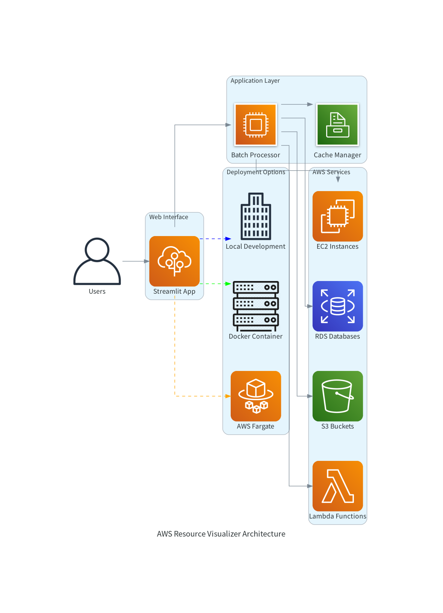
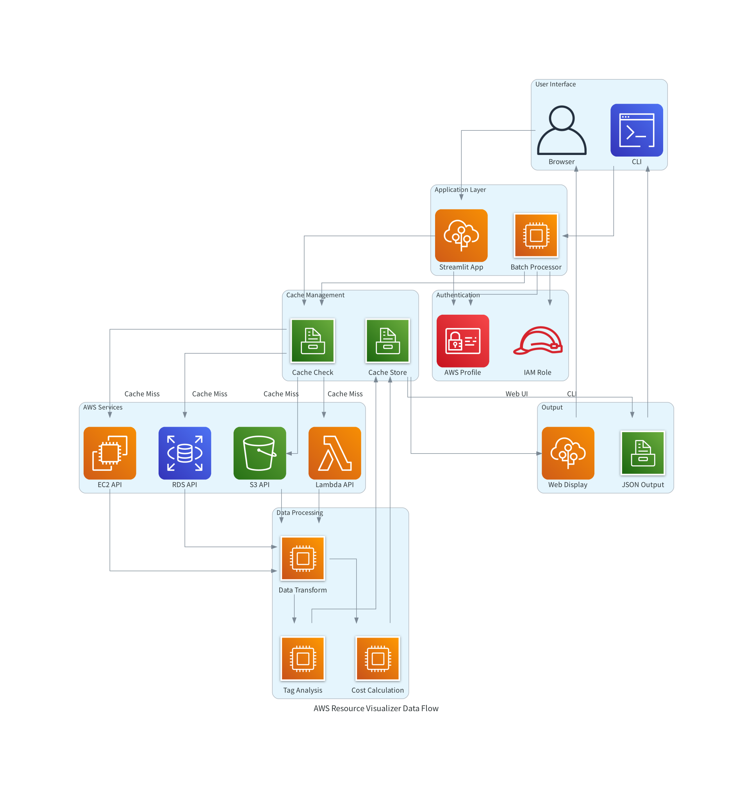
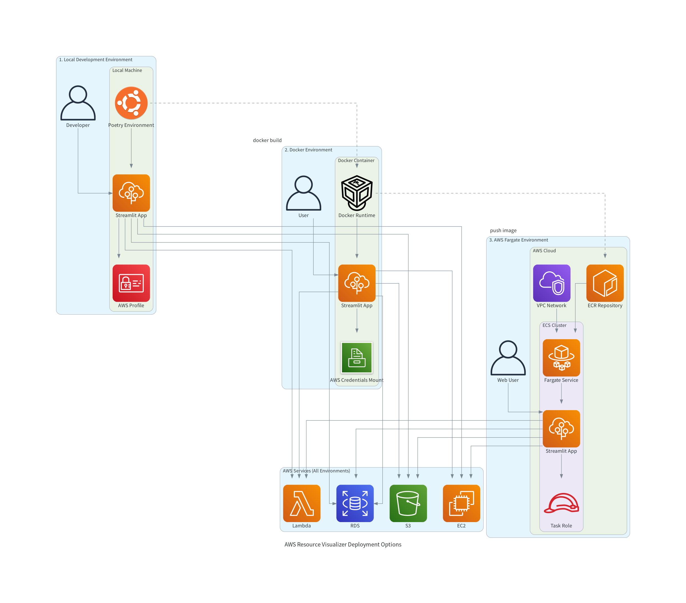

# アーキテクチャ

AWS Resource Visualizerは、AWSリソース（EC2、RDS、S3、Lambda）を一覧表示・可視化するStreamlitアプリケーションです。

## システム概要

- **実行モード**: WebUI（Streamlit）、バッチ処理（CLI）
- **実行環境**: ローカル、Docker、AWS Fargate
- **データ取得**: AWS API、ファイルキャッシュ（24時間TTL）
- **主要機能**: リソース一覧、タグ管理、概算コスト表示

## 全体アーキテクチャ



**レイヤード構成**:
- プレゼンテーション層: Streamlit UI / CLI
- アプリケーション層: ビジネスロジック
- データアクセス層: AWS API呼び出し
- データ永続化層: ファイルキャッシュ

## コンポーネント構成

以下では、システム理解に重要な主要コンポーネントのみを説明します。

### アプリケーション層

**Web アプリケーション (`app/web/`)**
- `app.py`: Streamlit設定、メイン処理制御
- `sidebar_ui.py`: プロファイル選択、リージョン選択、データ取得制御
- `main_content_ui.py`: リソース一覧表示、可視化、フィルタリング
- `batch_processor.py`: AWS API呼び出し、データ変換
- `pagination.py`: 大量データの分割表示
- `tag_filter.py`: タグベースのリソースフィルタリング

**バッチ処理 (`app/batch/`)**
- `main.py`: CLI引数解析、バッチ実行制御
- バッチプロセッサ: 並列データ取得、JSON出力

**共通モジュール (`app/shared/`)**
- `config.py`: 全システム設定の一元管理
- `state_manager.py`: セッション状態、ステータスファイル管理
- AWS API クライアント: 各サービスのAPI呼び出し
- キャッシュマネージャー: ファイルベースキャッシュ管理

### インフラストラクチャ層

**CloudFormation テンプレート (`cfn/`)**
- `cfn-ecr.yml`: ECR Repository
- `cfn-ecs.yml`: ECS Cluster, Fargate Service, Security Group

## データフロー



### データフローの詳細

1. **ユーザーリクエスト**
   - WebUI: ブラウザ → Streamlit App
   - CLI: コマンドライン → Batch Processor

2. **認証・認可**
   - AWS認証情報の検証
   - 必要なIAM権限の確認

3. **キャッシュチェック**
   - ファイルキャッシュの存在確認
   - TTL（24時間）の有効性確認

4. **AWS API呼び出し**
   - 並列処理による効率的なデータ取得
   - ページネーション対応
   - エラーハンドリング

5. **データ処理・変換**
   - 取得データの正規化
   - タグ情報の抽出・分析
   - コスト見積もり計算

6. **キャッシュ保存**
   - 処理済みデータのファイル保存
   - プロファイル・リージョン別の分離

7. **レスポンス生成**
   - WebUI: Streamlit コンポーネントでの表示
   - CLI: JSON形式での出力

### キャッシュ戦略

**キャッシュディレクトリ構造**:
```
{プロジェクトルート}/cache/
├── {profile}_{region}_ec2.json
├── {profile}_{region}_rds.json
├── {profile}_{region}_s3.json
└── {profile}_{region}_lambda.json
```

- **TTL**: 24時間（86400秒）
- **キー**: `{profile}_{region}_{service}`
- **形式**: JSON
- **サイズ制限**: なし（プロジェクトディスク容量に依存）

### ステータスファイル管理

**ステータスファイルディレクトリ構造**:
```
{プロジェクトルート}/cache/status/
├── status_{profile}_{region}.json
├── status_{profile}_{region}.json
└── ...
```

**機能**:
- **実行状態記録**: バッチ処理の実行状況を追跡（running, completed, failed）
- **WebUI連携**: リアルタイムでの実行状況表示
- **自動クリーンアップ**: 終了したプロセスのステータスファイル自動削除

**ファイル内容例**:
```json
{
  "status": "running",
  "services": ["EC2", "RDS"],
  "region": "us-east-1",
  "profile": "sandbox",
  "start_time": 1692123456.789,
  "pid": 12345
}
```

**ファイル命名規則**:
- **形式**: `status_{profile}_{region}.json`
- **プロファイル**: AWSプロファイル名（defaultの場合は"default"）
- **リージョン**: AWSリージョン名
- **用途**: 同一プロファイル・リージョンでの重複実行防止とステータス追跡

## デプロイメント方式



AWS Resource Visualizerは3つの実行環境をサポートしています：

- **ローカル開発環境**: Poetry + Python（開発・テスト用途）
- **Docker環境**: コンテナ化による環境の一貫性
- **AWS Fargate環境**: 本番運用、サーバーレス、高可用性

詳細な構築手順については[開発ドキュメント](development.md)を参照してください。

## パフォーマンス設計

### 並列処理

```python
# 同時実行数の制御
MAX_CONCURRENT_SERVICES: int = 5

# サービス別最適化
service_page_sizes = {
    "EC2": 1000,     # 最大ページサイズ
    "RDS": 100,      # 推奨ページサイズ
    "S3": 1000,      # 最大ページサイズ
    "Lambda": 50,    # APIハードリミット
}
```

### キャッシュ最適化

1. **キャッシュヒット率向上**
   - 適切なTTL設定（24時間）
   - プロファイル・リージョン別分離

2. **メモリ使用量最適化**
   - ファイルベースキャッシュ
   - 必要時のみロード

### UI応答性

1. **ページネーション**
   - 大量データの分割表示
   - 設定可能な表示件数（5, 10, 20, 50, 100件）
   - ページ移動コントロール（最初/前/次/最後）
   - 表示範囲と総件数の情報表示

2. **状態管理**
   - Streamlitセッション状態による画面状態保持
   - データ更新時の自動ページリセット
   - サービス・リージョン変更時の状態クリア

## 拡張性

### 新サービス追加

1. **設定追加**
   ```python
   SUPPORTED_SERVICES: Dict[str, str] = {
       "EC2": "Amazon Elastic Compute Cloud",
       "RDS": "Amazon Relational Database Service",
       "S3": "Amazon Simple Storage Service",
       "Lambda": "AWS Lambda",
       "ECS": "Amazon Elastic Container Service",  # 新規追加
   }
   ```

2. **API実装**
   - サービス固有のデータ取得ロジック
   - エラーハンドリング
   - ページネーション対応

3. **UI拡張**
   - 表示コンポーネント
   - フィルタリング機能
   - 可視化グラフ

## まとめ

AWS Resource Visualizerは、シンプルでありながら拡張性の高いアーキテクチャを採用しています。レイヤード アーキテクチャにより各コンポーネントの責務が明確に分離され、マルチ環境対応により様々な利用シーンに対応できます。

キャッシュ機能による高速化、並列処理による効率化により、実用的なAWSリソース管理ツールとして機能します。また、設定駆動の設計により、新しいAWSサービスの追加や機能拡張が容易に行えます。
