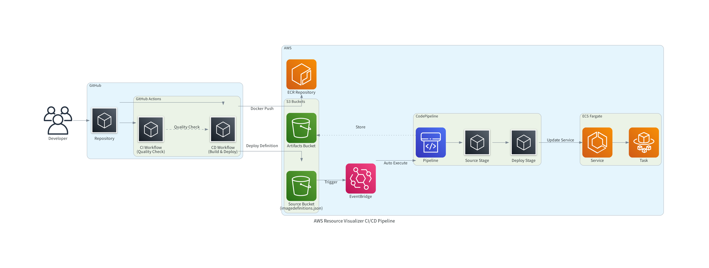

# アプリケーション CI/CD

アプリケーションのCI/CDパイプラインは、GitHub ActionsとAWS CodePipelineを組み合わせた構成です。

## CI/CD構成



**パイプライン全体フロー**:
1. 開発者がGitHubリポジトリにコードをpush
2. GitHub Actions CIでコード品質チェック実行
3. GitHub Actions CDでECRへのイメージpushとS3へのデプロイ定義配置
4. EventBridgeがS3イベントを検知してCodePipelineを自動実行
5. CodePipelineがECS Fargateサービスを自動更新

### GitHub Actions
- **CI**: コード品質チェック、テスト実行、セキュリティチェック
- **CD**: ECRへのイメージプッシュ、S3へのデプロイメント定義ファイル配置

### AWS CodePipeline
- **Source**: S3バケットからのソース取得
- **Deploy**: ECS Fargateサービスへの自動デプロイ

## GitHub Actions ワークフロー

### CI ワークフロー (`app_ci.yml`)

**トリガー**: 手動実行（`workflow_dispatch`）

**実行内容**:
1. **環境セットアップ**
   - Python 3.13
   - Poetry 2.1.2
   - just（タスクランナー）

2. **キャッシュ機能**
   - Poetry仮想環境キャッシュ
   - mypy型チェックキャッシュ

3. **品質チェック**
   - `just pylint`: コード品質・型チェック
   - `just pytest-cov`: テスト実行・カバレッジ測定
   - `just pysecurity-check`: セキュリティ脆弱性チェック

4. **結果出力**
   - GitHub Step Summaryに詳細結果を出力

### CD ワークフロー (`app_cd.yml`)

**トリガー**: 手動実行（`workflow_dispatch`）

**必要なシークレット**:
- `AWS_IAM_ROLE_APP`: GitHub Actions用IAMロールARN
- `AWS_S3_BUCKET`: CodePipeline用S3バケット名

**実行内容**:

**1. push ジョブ**
- ECRログイン
- Dockerイメージビルド・プッシュ（タグ: `github.sha`）

**2. deploy ジョブ**
- ECSタスク定義ファイル（`imagedefinitions.json`）作成
- S3バケットへのデプロイメント定義ファイル配置

## AWS CodePipeline

### パイプライン構成

**Source ステージ**:
- S3バケット: `awsresourcevisualizer-source-{AccountId}`
- トリガー: `imagedefinitions.json.zip`ファイルの配置
- EventBridge経由での自動実行

**Deploy ステージ**:
- ECSサービスの更新
- 失敗時の自動ロールバック

### 必要なリソース

**S3バケット**:
- `awsresourcevisualizer-source-{AccountId}`: ソースファイル格納
- `awsresourcevisualizer-artifacts-{AccountId}`: アーティファクト格納（30日保持）

**IAMロール**:
- CodePipelineサービスロール: ECS・S3操作権限
- EventBridgeロール: パイプライン実行権限

**通知機能**:
- AWS Chatbot経由でSlack通知（設定により有効化）

## GitHub Actions用IAMロール

### APP用ロール (`GithubActionsRoleApp`)

**信頼関係**:
- GitHub Actions OIDC Provider
- act（ローカルテスト）用のAssumeRole

**権限**:
- ECS操作（タスク一覧・実行・説明）
- ECR操作（認証・イメージプッシュ・プル）
- S3操作（CodePipeline用バケットへの読み書き）

## justfile タスク

### CI/CD関連タスク

**GitHub Actions**:
- `act-ci`: CIワークフローのローカル実行
- `act-cd`: CDワークフローのローカル実行
- `gha-install`: ワークフローファイルの`.github/workflows/`への配置

**AWS デプロイ**:
- `gha-role`: GitHub Actions用IAMロール作成
- `codepipeline`: CodePipelineスタック作成
- `ecr`: ECRリポジトリ作成
- `ecs`: ECS Fargateサービス作成

## デプロイフロー

### 初回セットアップ

```bash
# 1. IAMロール作成
RAINCMD=rain_deploy PROFILE=sandbox just gha-role

# 2. ECRリポジトリ作成
RAINCMD=rain_deploy PROFILE=sandbox just ecr

# 3. ECS Fargateサービス作成
RAINCMD=rain_deploy PROFILE=sandbox just ecs

# 4. CodePipeline作成
RAINCMD=rain_deploy PROFILE=sandbox just codepipeline
```

### 継続的デプロイ

1. **GitHub Actions CD実行**
   - ECRへのイメージプッシュ
   - S3への`imagedefinitions.json.zip`配置

2. **CodePipeline自動実行**
   - EventBridgeがS3イベントを検知
   - ECS Fargateサービスの自動更新

## ローカルテスト

### act を使用したGitHub Actionsテスト

```bash
# CI ワークフローテスト
just act-ci

# CD ワークフローテスト（要AWS認証）
PROFILE=sandbox ACT_PROFILE=sandbox just act-cd
```
