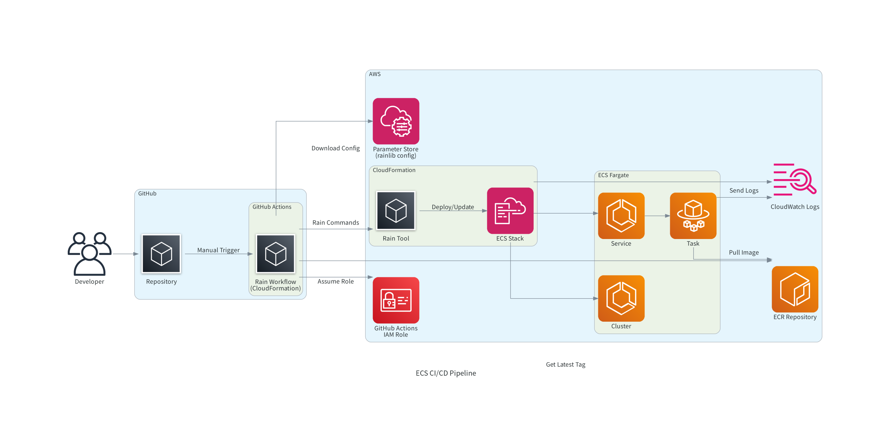

# ECS CI/CD

ECSのCI/CDパイプラインは、GitHub ActionsとCloudFormation(rain)、SSMパラメータストアを組み合わせた構成です。

## CI/CD構成



**パイプライン全体フロー**:
1. 開発者がGitHubリポジトリから手動でRainワークフローを実行
2. GitHub ActionsがIAMロールを引き受けてAWS認証
3. SSMパラメータストアからrainlib設定ファイルを取得
4. ECRから最新イメージタグを自動取得（未指定時）
5. RainツールでCloudFormationスタックを操作（デプロイ・更新・削除等）
6. ECS Fargateサービスとタスクが自動更新される

### GitHub Actions
- **Rain**: CloudFormationテンプレートの操作（デプロイ、削除、差分確認等）

### SSMパラメータストア
- **設定ファイル管理**: rainlib設定ファイルをSSMパラメータストアで一元管理
- **GitHub Actions連携**: ワークフロー実行時にSSMから設定ファイルを自動取得
- **セキュリティ**: アカウント固有の設定情報をGitリポジトリに含めずに管理

## GitHub Actions ワークフロー

### Rain ワークフロー (`rain.yml`)

**トリガー**: 手動実行（`workflow_dispatch`）

**入力パラメータ**:
- `rain_target`: 実行するRainコマンド（rain_lint, rain_forecast, rain_deploy, rain_rm, rain_diff, rain_ls, rain_logs, rain_tree, rain_info）
- `ecr_tag`: 使用するECRイメージタグ（空の場合は最新イメージを使用）
- `desired_count`: ECSサービスの希望タスク数（空の場合は現在のECS設定を使用）

**必要なシークレット**:
- `AWS_IAM_ROLE_RAIN`: Rain操作用IAMロールARN

**実行内容**:

**1. 環境セットアップ**
- AWS CLI v2インストール（actの場合のみ）
- justタスクランナーインストール
- rainツールインストール（最新版を自動取得）
- cfn-lintインストール

**2. AWS認証**
- OIDC認証によるIAMロール引き受け（GitHub Actions環境）
- プロファイル設定の除去（GitHub Actions環境用）

**3. 設定ファイル取得**
- SSMパラメータストアからrainlib設定ファイルをダウンロード

**4. ECRタグとDesiredCount設定**
- ECRタグ未指定時：ECRから最新タグを自動取得
- DesiredCount未指定時：現在のECSサービス設定を取得

**5. ECS操作実行**
- 指定されたrainコマンドの実行
- デプロイ・削除時の自動承認オプション設定（`-y`フラグ）

**6. 結果出力**
- GitHub Step Summaryに実行結果を出力

## GitHub Actions用IAMロール

### RAIN用ロール (`GithubActionsRoleRain`)

**信頼関係**:
- GitHub Actions OIDC Provider
- act（ローカルテスト）用のAssumeRole

**権限**:
- **CloudFormation操作**: スタック作成・更新・削除・説明
- **IAM操作**: ロール作成・削除・ポリシー管理・PassRole
- **EC2操作**: セキュリティグループ・VPC・タグ管理
- **ECR操作**: イメージ説明
- **ECS操作**: クラスター・サービス・タスク定義管理
- **CloudWatch Logs操作**: ロググループ管理
- **SSM操作**: パラメータ取得
- **S3操作**: rain用アーティファクトバケット操作

## justfile タスク

### CI/CD関連タスク

**GitHub Actions**:
- `act-rain`: Rainワークフローのローカル実行
- `gha-install`: ワークフローファイルの配置

**AWS デプロイ**:
- `gha-role`: GitHub Actions用IAMロール作成
- `ssm-put-rainlib`: rainlib設定ファイルのSSM登録
- `ssm-get-rainlib`: SSMパラメータ一覧表示
- `ssm-delete-rainlib`: SSMパラメータ削除
- `ssm-download-rainlib`: SSMからrainlib設定ファイル取得

## デプロイフロー

### 初回セットアップ

```bash
# 1. IAMロール作成
RAINCMD=rain_deploy PROFILE=sandbox just gha-role

# 2. rainlib設定ファイルをSSMに登録
PROFILE=sandbox just ssm-put-rainlib

# 3. ECSスタック作成
RAINCMD=rain_deploy PROFILE=sandbox just ecs
```

### 継続的デプロイ

1. **GitHub Actions Rain実行**
   - SSMから設定ファイル取得
   - ECRタグとDesiredCountの自動設定
   - 指定されたrain操作実行

2. **ECS自動更新**
   - タスク定義更新時の自動デプロイ
   - 失敗時の自動ロールバック

## ローカルテスト

### act を使用したGitHub Actionsテスト

```bash
# Rain ワークフローテスト（要AWS認証）
PROFILE=sandbox ACT_PROFILE=sandbox RAINCMD=rain_lint just act-rain
```
